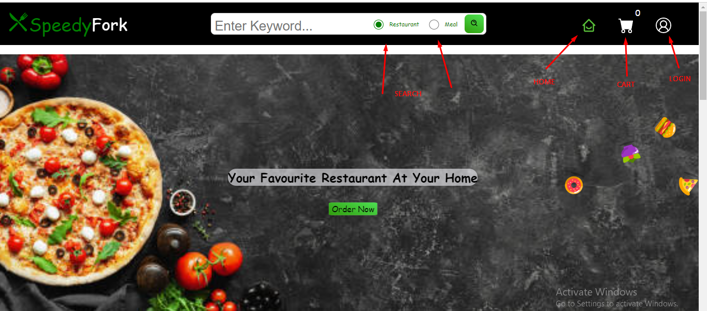

 <p align="center">
<a href="https://www.meraki-academy.org" target="_blank" rel="noopener noreferrer">
 
 </a>
</p>

<h3 align="center">Speedy Fork
</h3>

---

<p align="center"> An awesome Project to describe README 
    <br> 
<a href=''>Demo</a>
    <br> 
</p>

## 📝 Table of Contents

- [About](#about)
- [Getting Started](#getting_started)
- [Usage](#usage)
- [Built Using](#built_using)
- [User Story](#user_story)
- [Data Flow](#data_flow)
- [Guided By](#guided_by)

## 🧐 About <a name = "about"></a>

Speedy Fork is the quickest and most efficient way to get your favorite food delivered straight to your door. With our vast selection of restaurants, you can always find something to satisfy your cravings.
Our easy to use website allows you to quickly and easily place your order. You can even customize your order to make sure you get exactly what you want. We guarantee fast and reliable delivery, so you can get your food quickly and without any hassle.


## 🏁 Getting Started <a name = "getting_started"></a>

These instructions will get you a copy of the project up and running on your local machine for development and testing purposes.

### Prerequisites

- Visual Studio Code follow this <a href=''>link</a> to install.
- Git Bash follow this <a href=''>link</a> to install.
- MongoDB follow this <a href=''>link</a> to install.
- Node.js follow this <a href=''>link</a> to install.

### Installing:

1. Clone the repo to your local machine using git bash.

```
git clone https://github.com/your_username_/Project-Name.git
```

2. Install packeges repeat this step in backend and frontend folder

```
npm i
```

3. Run server using git bash inside backend folder

```
npm run dev
```

4. Run application using git bash inside frontend folder

```
npm run start
```

Now app ready to use

## 🎈 Usage <a name="usage"></a>



- You don't have to register to navigate our web app
- You can search by Restuarent or by meal 

image.png
## ⛏️ Built Using <a name = "built_using"></a>

- [MongoDB](https://www.mongodb.com/) - Database
- [Express JS](https://expressjs.com/) - Server Framework
- [React JS](https://https://reactjs.org/) - Web Framework
- [Node JS](https://nodejs.org/en/) - Server Environment

## User Story <a name = "#user_story"></a>

Your trello board link
<a href='https://trello.com/b/GsjKnaIp/talabat'>Trello</a>

## Data Flow <a name = "#data_flow"></a>

</a>


## ⚠️ Guided By <a name = "guided_by"></a>

This project is guided by ©️ **[MERAKI Academy](https://www.meraki-academy.org)**